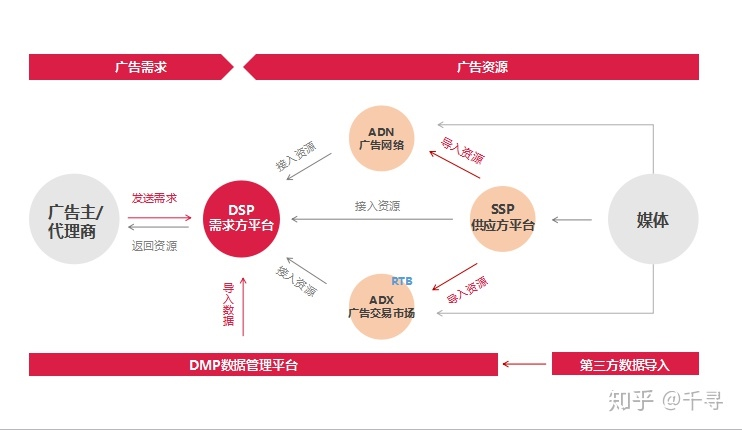
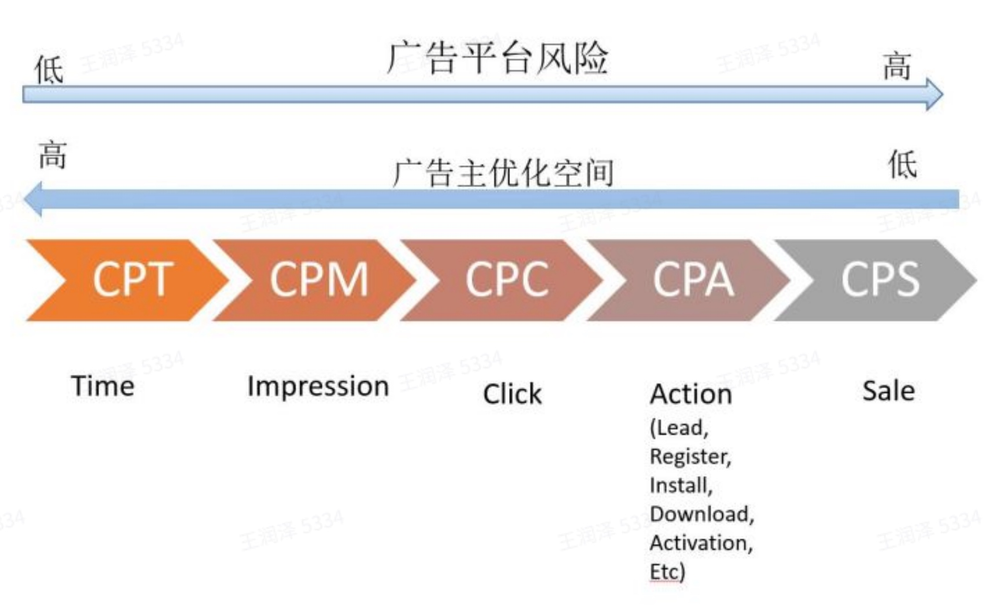
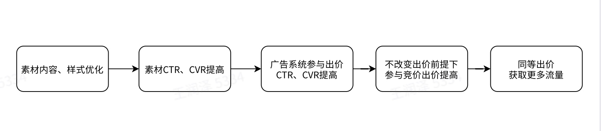
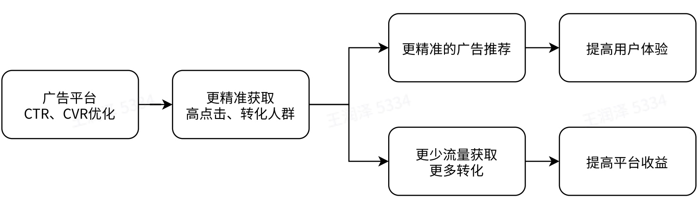
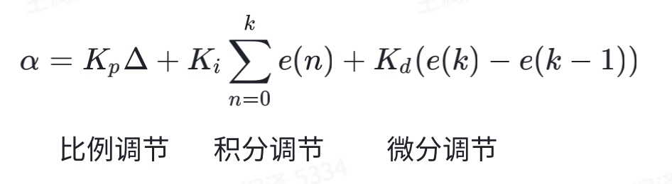

# 计算广告学习笔记

<b>auth:ladlod</b>

**********************************************
## 一、广告
### 广告是什么
>> **广告**：是由已确定的出资⼈通过各种媒介进⾏的有关产品（商品、服务和观点）的，通常是有偿的、有组织的、综合的、劝服性的⾮⼈员的信息传播活动，可作为商业化的⽅式之⼀。
>> **商业化**：是将流量、数据、影响⼒通过商业产品的⽅式转为收⼊的过程。
>> **广告参与方**：⼴告主、媒体（⼴告平台）、受众
### 广告的投放过程可以看做三方博弈的过程
>> **广告主**：广告需求方，主动参与 **目标**：高roi，更低的成本获取更高的收益
>> **媒体**：流量供给方，主动参与 **目标**：流量收益最大化，平衡收益与用户体验
>> **受众**：广告接受者，被动参与
## 二、相关名词介绍
- cpt(cost per time) 独占时间成本
- cpm(cost per mille) 千次展示成本
- cpc(cost per click) 每次点击成本
- cpa(cost per action) 每次转化成本,register,install,download,activation...
- cps(cost per sale) 每次成交成本
- ctr(click through rate) 点击率
- roi(return on investment) 投入产出比
- cvr(conversion rate) 转化率
- rtb(real time bidding) 实时竞价
- rta(real time api) 实时api
- dsp(demand site platform) 流量需求方平台
- ssp(supply site platform) 流量供给方平台
- dmp(data management platform) 数据管理平台
- adx(ad exchange) 广告交易平台
- adn(ad network) 广告网络
- eCpm(expect cost per mille) 千次展示期望收入
- oCpm(optimized cpm) 以转化效果为目的的展示广告计费模型
- oCpc(optimized cpc) 以转化效果为目的的点击广告计费模型
- pv(page view)，uv(unique vistor) 页面访问量，独立访客数
- gd(guarantee delivery) 担保式定向投送广告（包量）
- gmv(gross merchandise volume) 商品交易总额
- advertiser 广告主
- ad group 广告组
- ad campaign 广告计划
- ad creative 广告创意
- gfp(generalize first auction) 广义第一定价
- gsp(generalized second-price) 广义第二定价
- vcg(vickrey calrke groves) vcg竞价机制
- mrp(market reserve price) 市场保留价
## 三、常见的计算广告架构

### dsp平台
**demand site platform**，dsp平台汇集了众多的用户历史行为，构建了精准的用户画像，帮助需求方（广告主或代理商），以一个统一个接口来管理adx。需求方可以在dsp平台设置广告定向、预算、出价创意等，dsp通过技术和算法手段进行自动优化投放效果并输出数据报告。

在dsp平台出现前，广告主想要在多个媒体上投放广告十分复杂，dsp把广告主、代理商从庞杂的手工操作中解放了出来，广告主只需要在dsp平台投放广告即可，由dsp帮助广告主在多个平台投放广告。
### dmp平台
**data management platform**，即数据管理平台，dsp平台的受众定向需要精确到个体，这样精准的定向依赖于dmp实现。
### ssp平台
**supply site platform**，即流量供给方平台，也可以说是媒体平台。
### adx广告交易平台
**ad exchange**，可以理解成多个dsp进行公平竞价的地方，ecpm最高者竞胜获得广告展示机会，adx将最终获得的广告素材信息返回给ssp平台。
### rtb实时竞价
**real time bidding**，实时竞价，是dsp或adx的核心能力之一，这一购买方式可以帮助广告主以一个合理、透明的价格获得最有价值的曝光机会。
### rta实时api
**real time api**，是直投与dsp或adx结合的一种投放方式，即每次请求时，广告平台都通过api询问广告主是否参竞，结合广告主返回的决策进行下一步的广告优选投放，提升广告主的广告投放效果。
### 一次广告的投放流程
- 网站/客户端发起一次广告请求至ssp，请求中包括用户的基本信息，设备信息，广告位信息及上下文信息等。
- ssp向adx发起广告请求
- adx向一个或一批dsp同时发起广告请求
- dsp收到广告请求，向dmp发起数据请求，获取用户画像
- dsp获取用户画像后，召回一批合适的广告并向实时竞价系统发起一次竞价
- 竞价系统收到广告后举行一次拍卖，拍卖的规则由dsp方自定义，每次拍卖规则可能不同
- 竞价系统选举出一个/多个投放效果最优的广告，返回给dsp系统
- dsp系统将广告返回给adx系统
- adx系统收到一个/多个dsp返回的广告后发起一次公平竞价，竞价规则一般为根据ecpm排序
- adx将竞胜的广告返回给ssp方做协议解析并返回给网站/客户端
- 广告展示给用户，并将用户对该广告的转化/反馈行为回传给对应的dsp方
- dsp收到用户转化/反馈信息，将数据流入dmp系统，进行进一步的用户画像，并对该广告进行计费相关处理
## 四、广告售卖形式
### 不同的售卖方式
**cpt**

      独占时间成本，广告主出价，包揽某一时间段的全部广告曝光
**cpm**

      千次曝光成本，计算方式 消耗/曝光*1000
**cpc**

      单次点击成本，即按照广告点击数进行计费
**cpa**

      单次转化成本，即按照广告转化数进行计费
**cps**

      单次购买成本，即按照广告获得的商品售卖情况进行计费
**ocpm**

      以转化为目的，以展示作为计费方式的计费模型
**ocpc**

      以转化为目的，以点击作为计费方式的计费模型
**ecpc**

      广告主点击出价，媒体动态调整cpc价格进行计费
### 经典售卖方式对比
售卖方式|竞价价格|计费|出价点|计费点|平台参与度
--|--|--|--|--|--
Cpm|bidM * 1000|bidM * 1000|展示|展示|-
Cpc|bidC * pCTR * 1000|bidC * 1000|点击|点击|pCTR
Cpa|bidA * pCTR * pCVR * 1000|bidA * 1000|转化|转化|pCTR、pCVR
oCpc|bidA * pCTR * pCVR * 1000|bidA * pCVR * 1000|转化|点击|pCTR、pCVR
oCpm|bidA * pCTR * pCVR * 1000|bidA * pCTR * pCVR * 1000|转化|展示|pCTR、pCVR
eCpc|bidC * pCVR/CVR|bidC * pCVR/CVR|点击|点击|pCVR
### 不同的诉求

### 不同的出价方式
#### gfp出价
**广义第一出价**，传统的出价方式，按照广告主出价进行排序，拍卖机制不稳定，广告主会根据他人出价随时改动出价，许多广告主使用了自动调价策略，排在第一位的广告主保证自己的出价始终比排在第二位的广告主出价高一点，排在二三位的广告主可能因此放弃高出价或与广告主互相竞争，造成广告系统价格波动大，收益不稳定。
#### gsp出价
**广义第二出价**，按照广告主的出价进行排序，结算时按照该广告主下一名的出价进行结算，即假设a，b，c三个广告主出价10，5，2，则结算时a广告主按照5结算，c广告主按照2结算，c广告主按照0-2（底价）进行结算。这种出价方式减少了广告主之间的博弈，广告主实际付费是基于其它广告主出价的，以此保证了计费的公平以及广告系统收益的稳定性。
#### vcg出价
**帕累托改善**，指给固定的人群分配固定的资源，通过资源分配的改善，在不影响任何人利益的情况下，使得至少一个人的利益提高。

**帕累托最优**，指资源分配的一种理想状态。在此状态下，任何一种变化都会造成一部分人的利益受损。

**vcg出价**，即基于帕累托最优的想法，在一个广告主获得竞胜后，会给整个竞价过程中的其它参与对象造成损失，这种损失应当由该广告主承担，也就是说这部分损失的费用，即为该广告主应当支付的费用。

**例**：

广告位|每小时点击量
-|-
1|200
2|100
3|50

广告主|每次点击获得收益
-|-
a|12
b|10
c|5

    假设在一次竞价中，仅c参与竞价，则c获得1号广告位，c获得的受益为200*5 = 1000
    假设在一次竞价中，仅b、c参与竞价，则b获得1号广告位，c获得2号广告位，c获得的收益为100 * 5 = 500
    因此，b的参与对c的收益造成了500的损失，所以b的广告费用应该为500/200=2.5/点击，获得的收益为200 * 10=2000
    假设在一次竞价中，a、b、c均参与竞价，则a获得1号广告位，b获得2号广告位，c获得3号广告位，那么b，c获得的总收益为 100 * 10+50 * 5=1250
    因此，a的参与对b、c的收益共造成了2500-1250=1250的损失，所以a的广告费用应该为1250/200=6.25/点击，获得的收益为12 * 200=2400
    vcg算法是一种公平的竞拍算法，但在目前的计算广告中的应用场景不多，因为实现复杂，广告主较难理解，并且会一定程度削减平台的收益。
### OCPX
**依据上文分析供求双方诉求可得结论，计费点前移，有利于广告平台降低收益风险，计费点后移，有利于广告主降低成本风险，所以推出了一种出价点后移，计费点前移的出价策略，即ocpx(optimized cpx)。考虑到广告主的主要诉求是roi，广告平台的诉求是更大的收益，催生了以转化效果为目的的展示或点击广告计费模型（ocpm、ocpc），转化效果可以是下载、注册、激活、购买等行为，而实际收费是按照展示或点击进行收费。**
#### 内在的激励机制
**广告主**

**广告平台**

#### OCPM VS OCPC
**OCPM**

    ecpm = α ∗ bidA ∗ pCTR ∗ pCVR ∗ 1000
    
    灵活性更高，相对ocpc没有更严格的点击事件要求，使得ocpm有着更好的拓展性，能够适配各种新型转化目标及创意样式；
    对广告平台更友好。
**OCPC**

    cpc = α * bidA * pCTR
    
    对cvr预估准确率要求更高，对ctr预估准确率相对ocpm更低；
    安全性更高，由于曝光作弊成本较低，而点击作弊成本高，所以ocpc在防作弊方面表现的更好；
    对广告主更友好。
#### 动态出价因子
**公式中的pctr、pcvr均为预值，所以最终计费是按照预估进行计费，因此，广告roi很大程度取决于点击率模型、转化率模型预估的准确与否。**

    出价过程中
    若ctr/cvr模型预估不准，导致广告主成本偏差怎么办？
    若gsp参与竞价的广告主不充分，导致成本普遍偏低怎么办？（上文中的gsp理论）
    归因数据延迟，导致cvr偏低，很难跑量怎么办？
为了解决以上问题，我们在公式中引入了动态调价因子α，在α的计算中，我们引入了pid控制算法。
[PID控制算法原理](https://zhuanlan.zhihu.com/p/39573490)

此处依赖于广告转化数据流，获得实时成本，与当前出价作比对，获得误差值，代入公式获得α。（出价中一般只用到积分）
#### 市场保留价
**market reserve price**，广告拍卖中，会保留一个最低拍卖价，低于该价格出价的广告不参与拍卖。

如果底价过高，会打击广告主积极性，并且如果一个位置流量不好，会出现所有出价均低于底价的情况，导致广告位无填充，影响广告平台/媒体收益。

如果底价过低，底价没有起到实际的作用，广告主可以以一个较低的价格获得广告位，影响广告平台/媒体收益。

**动态市场保留价**，依据实时竞价数据调整底价，可以将底价设置为达成较好的几个广告主出价和预设底价的最大值，使得竞胜价高于底价高于二价，最后以底价结算，广告平台/媒体获得额外收益。
#### 价格挤压
以cpc出价举例，ecpm = pctr^k * bidc，k即为价格挤压因子。

按照这种计算方式，可以根据市场状态，通过调整k来引导竞价发展方向。

增大k，提高ctr在竞价过程中的影响程度，可以提升广告质量，解决广告质量低的问题。

减小k，提高出价在竞价过程中的影响程度，可以鼓励广告主出价，短期提升收益。
#### OCPX双出价
**双出价(深度转化出价)**，是对达成敏感的广告主做的进一步优化，适合转化数据稀疏，又想优化转化效果的广告主。

双出价一般会在转化目标1（如激活）转化成本可控的基础上，优化转化目标2（如次留、付费）的转化成本。

以激活、付费双出价为例，该出价模式有两个不同的出价点，广告主将这两个出价数据和转化数据都给到媒体平台，让媒体根据这两种出价计算计费点，这时会算出两个计费值，而且往往这两个值是不同的，媒体方从两个不同的计价值中计算出最终的价格。

**计算方法**：

方法1：取二者中较小的那个，会影响跑量和平台收益，但保证了成本

方法2：取二者加权值，成本不如方法1稳定，但跑量和平台收益较好

**优势**：

在选择投放流量时，前期转化数据较少，转化成本在收敛到出价之前，会经历较大的波动，某个时刻甚至会远超出付费出价，导致冷启动过程中该部分流量被舍弃，广告主对达成率不满意而停投广告。

双出价策略可以通过前期不放弃某部分转化成本不达标的流量（如两种转化成本仅满足一种），来达到降低成本波动的效果。
#### 广告主预算平滑投放
**budget pacing**，这种技术是让广告主的预算在投放时间段（或投放流量）内的花费分布更合理。

例：比如说广告主是小朋友，妈妈每个月给90元零花钱，那她是每天花3元？还是月初每天花1元，月末多花点呢？

**对广告主**：

避免预算在投放初期耗尽，无法参与后期竞价；

帮助广告主触及到更多不同的用户；

有机会提升广告转化效果。

**对广告平台/媒体**：

使广告竞争更激烈，提升平台收益；

避免竞争都发生在投放初期，整个系统更加平稳；

为广告主提供更多选项，优化转化效果。

**平滑投放的主流技术**：

Probabilistic throtting(概率节流)：通过某种方式舍弃一部分流量，不参与竞价

Bid Modification(调整出价)：直接修改价格，调整投放速率。
#### 推荐阅读
[OCPC实践录](https://mp.weixin.qq.com/s?__biz=MzU2MDE5MzA2Ng==&mid=2247483732&idx=1&sn=0e3fe2ad9eb242ba38211af752c30e2a&chksm=fc0a8a11cb7d0307d1c2a339b1d9ce2167743aa1286c4eedec73369ecc85dbb9737b38a077c2&cur_album_id=1362906257140858882&scene=190#rd)