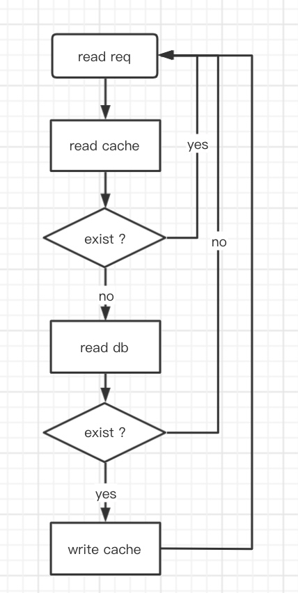
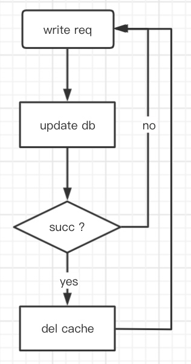
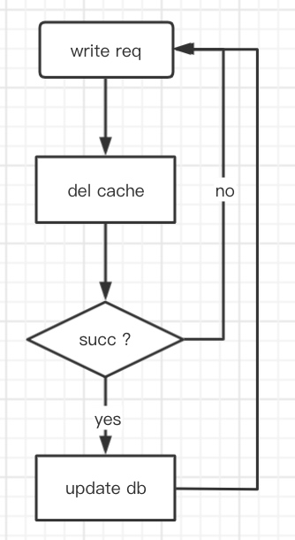
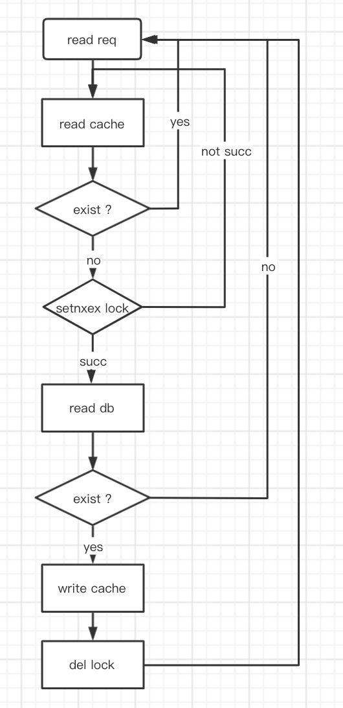
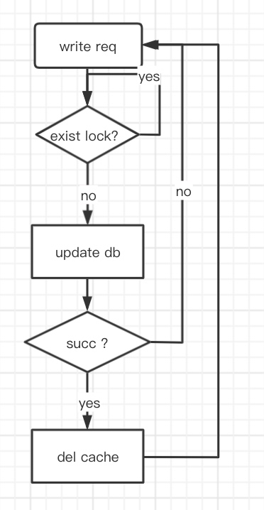

# 缓存一致性问题
## 问题背景
    在工程上，我们处理缓存问题时一般有以下方法
### 读操作

### 写操作
### 先写后删

### 先删后写

### 问题
    我们在使用先删后写时，如果按照以下顺序执行
读操作|写操作
-|-
-|删除cache
读db获取数据a|-
-|修改db数据从a至b
设置cache数据为a|-
    出现了缓存数据不一致的情况，所以在不考虑加锁的情况，我们通常选择先写后删这种方式。在先写
    后删这种情况下，我们假设删除cache的操作不会失败，通常情况下不会出现任何缓存不一致的问题
    ，仅当按照以下顺序执行时
读操作|写操作
-|-
读cache数据为空|-
读db获取数据为a|-
-|修改db数据为b
-|删除cache
设置cache数据为a|-
    出现了缓存数据不一致的情况。在实际业务场景中，我们遇到了这样的问题，导致广告审核结果
    未能及时生效，现在我们设计方案来进行修复。
## 方案1.先删后改，串行处理
    我们可以将删除cache操作前置于改db操作（这样做实际上仅避免了删除cache失败造成的缓存数据
    不一致，我们假设删除cache成功，修改db失败，这样仅会对db多造成一次io而已，而不会出现数
    据不一致），为了避免问题描述中的先删后写造成的数据不一致，我们可以对同一个缓存key的操作
    串行化，将所有读写请求串行处理，实际上对于所有的写操作我们可以合并成同一个操作。（此处不
    考虑加锁实现原因是为了保持写操作的有序性）
## 方案2.延迟队列
    我们依然选择先改db，后删cache的操作，将删cache的操作置后，拉长写db与删cache的时间间隔
    ，保证读操作的读db和写cache操作不会发生在一次完整的写操作前后。另外，对延迟队列消费我们
    可以保证消费消息的可靠性，删除cache失败则进行重试或重写队列，从而保证不会出现删除cache
    失败带来的缓存数据不一致问题
## 方案3.读加写锁
    我们发现，先改后删这种模式带来的缓存不一致问题，仅会出现在读先行于写这种情况下，所以我们
    可以考虑，在读行为上加一个分布式读共享，写排他的锁，仅当读操作完成后才可以开始一次写行为
    ，即可避免这种问题。
### 分布式写锁实现
    利用redis的incr和exists命令来实现一个分布式写锁。
    在加锁时对锁key进行一次inc，同时更新锁的过期时间，释放锁后对锁key进行一次dec，并判断是
    否为0，若为0则删除key。
    在获取写锁是判断key是否exists，不存在时获取锁。
```
    // 读端
    // 加锁操作
    local res = redis.call('incr', KEYS[1]);
    redis.call('expire', KEYS[1], ARGV[1]);
    return res
    // 释放锁操作
    if redis.call('incrby', KEYS[1], -1) <= 0 then return redis.call('del', 
    KEYS[1]) else return 0 end
```
```
    // 写端
    // 获取锁操作
    exists key
```
### 分析
    在本方案实现下，我们已经避免了缓存数据的不一致性，但我们知道，读操作相对于写操作是一种相
    当高频的操作，若某热点key的读操作始终处于进行中，那么我们的写操作就会永远获取不到锁导致
    写失败。所以我们可以将锁加到每次读操作读db之前，而不是读cache之前，这使我们联想到了缓存
    击穿。
**缓存击穿**
>> 缓存击穿是指缓存中没有但数据库中有的数据（一般是缓存时间到期），这时由于并发用户特别多，同时读缓存没读到数据，又同时去数据库去取数据，引起数据库压力瞬间增大，造成过大压力。和缓存雪崩不同的是，缓存击穿指并发查同一条数据，缓存雪崩是不同数据都过期了，很多数据都查不到从而查数据库。
>> 对于缓存击穿，我们常见的做法是热点key永不过期，对读db操作加互斥锁。

    所以我们实际上可以在每次读db之前，加一个读之间互斥，读写之间也互斥的分布式锁即可，即我们
    常使用的分布式互斥锁。
### 结论
    所以我们对原有方案的优化方案如下。
#### 读操作

#### 写操作



    
