# mysql实战45讲-MySQL为什么有时候会选错索引？
## 课前回顾
### Q1 如果某次写入使用了change buffer机制，之后主机异常重启，是否会丢失change buffer和数据
change buffer的数据在事务commit时也会写入redo log，所以崩溃恢复时change buffer中的数据也可以找回来。
## 引言
前面我们介绍过索引，你已经知道了在 MySQL 中一张表其实是可以支持多个索引的。但是，你写 SQL 语句的时候，并没有主动指定使用哪个索引。也就是说，使用哪个索引是由 MySQL 来确定的。那么mysql是怎么选取索引的呢。不知道你有没有碰到过这种情况，一条本来可以执行得很快的语句，却由于 MySQL 选错了索引，而导致执行速度变得很慢？
## 案例case
我们先建一张表，里面除了主键，还有a，b两个字段，分别建上索引
```
CREATE TABLE t (
  id int(11) NOT NULL,
  a int(11) DEFAULT NULL,
  b int(11) DEFAULT NULL,
  PRIMARY KEY (id),
  KEY a (a),
  KEY b (b)
) ENGINE=InnoDB;
```
然后，我们往表 t 中插入 10 万行记录，取值按整数递增，即：(1,1,1)，(2,2,2)，(3,3,3) 直到 (100000,100000,100000)
```
delimiter ;;
create procedure idata()
begin
  declare i int;
  set i=1;
  while(i<=100000)do
    insert into t1 values(i, i, i);
    set i=i+1;
  end while;
end;;
delimiter ;
call idata();
```
接下来，我们分析一条 SQL 语句：
``` 
select * from t where a between 10000 and 20000;
```
你一定会说，这个语句还用分析吗，很简单呀，a 上有索引，肯定是要使用索引 a 的。
你说得没错，下图显示的就是使用 explain 命令看到的这条语句的执行情况。

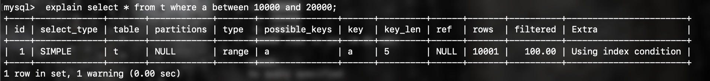
看上去，这条查询语句的执行也确实符合预期，key 这个字段值是’a’，表示优化器选择了索引 a。

不过别急，这个案例不会这么简单。在我们已经准备好的包含了 10 万行数据的表上，我们再做如下操作。

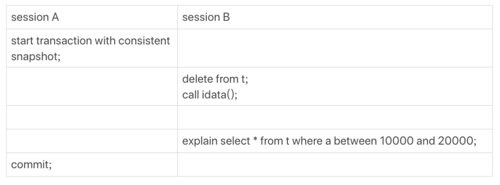

大家来猜一下，这时select语句的索引选择情况如何呢？

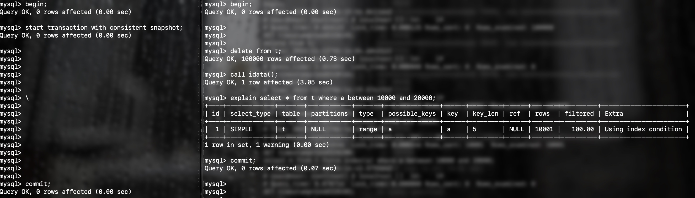

可以看到，该条select语句依然选择了索引a，但mysql45讲中告诉我们按照这个case执行，这条语句不会选择索引a，这是怎么回事？不要着急，我们修改一下我们的表。
```
alter table t modify column id int(11) not null auto_increment;
```
由于修改了主键为自增主键，所以存储过程我们也需要修改一下
```
drop procedure idata;
delimiter ;;
create procedure idata()
begin
  declare i int;
  set i=1;
  while(i<=100000)do
    insert into t values(null, i, i);
    set i=i+1;
  end while;
end;;
delimiter ;
```

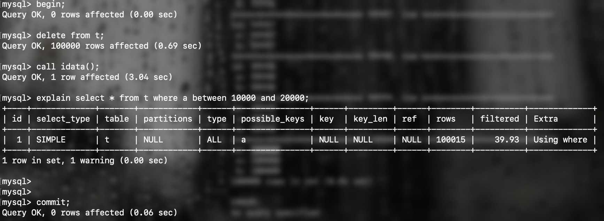

可以发现，在这种情况下查询没有走索引a，那么在这种情况下到底是使用索引a查询更快还是不使用索引a查询更快呢？
我们首先将mysql的慢查询日志打开
```
set global slow_query_log = ON;
set long_query_time=0;
```
在同一个事务中，我们分别使用索引a和全表扫描执行一次查询

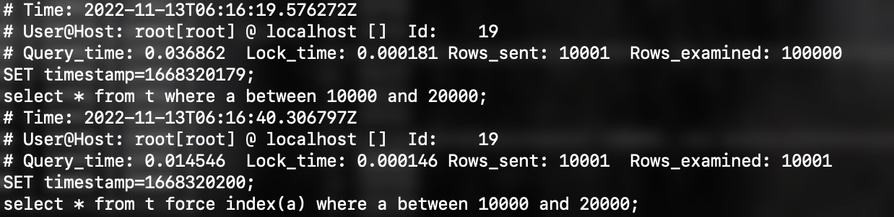

可以看到，使用索引a的查询时间为0.0145ms，远小于全表扫描的0.0369ms，可是mysql为什么选择了执行时间更长的查询方式呢？
## mysql优化器的成本预估
> 在上一节的case中，我们发现了两个问题，在这一节中，我们将通过了解mysql优化器执行的成本预估来进行解答。
> 1. 为什么mysql在上述case中选择了错误的执行计划？
> 2. 为什么将主键索引修改为自增之后才出现这种问题，而按照mysql45讲中给到的case没有复现问题？
### mysql成本模型
#### IO成本
从磁盘到内存的加载过程损耗的时间成本称之为IO成本。mysql认为，每从磁盘中获取一页数据的io成本为0.25（不同版本系数不同）
#### CPU成本
读取以及监测记录是否满足对应的搜索条件，对结果集进行排序等操作损耗的时间成本成为CPU成本。mysql认为，每从内存中获取一条数据的cpu成本为0.1（不同版本系数不同）
### mysql成本优化步骤
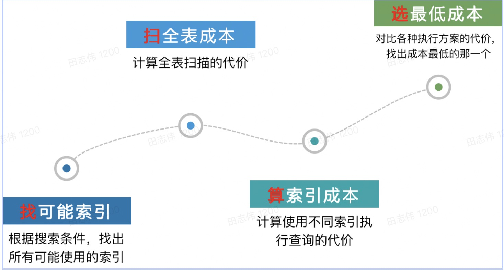

### mysql成本预估公式
- 聚簇索引
    1. 使用**聚簇索引文件大小**除以**每一页的大小**获得需要加载到内存中的页数
    2. 在计算IO成本时，引入一个微调值 1.1
    3. 在计算cpu成本时，引入一个微调值 1.0
- 二级索引
    1. mysql粗暴地认为，每查询一个范围区间，需要一页数据的io成本
    2. mysql再次粗暴地认为，每次回表查询，需要消耗一页数据的io成本
    3. 在计算IO成本时，去掉微调值
    4. 在计算cpu成本时，微调值调整为0.01

按照以上成本预估公式，我们对上述case中的语句进行成本预估
```
select * from t where a between 10000 and 20000;
```

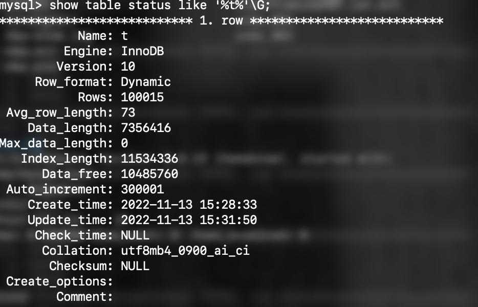

按照上述公式，我们可以得到使用主键索引我们预估的成本为
```
(7356416/(16*1024)*0.25+1.1) + (100015*0.1+1.0) = 10115.85
```
使用索引a我们预估的成本为
```
(1*0.25+10001*0.25) + (10001*0.1+0.01) = 3500.61
```
异常情况又出现了，为什么按照公式进行预估计算，得到索引a的成本要远小于全表扫描，mysql依然选择了使用全表扫描的执行计划呢？会不会是我们的预估公式有问题？
### optimizer_trace 
> mysql的优化器追踪功能，开启后会记录mysql优化器的执行日志
```
set optimizer_trace="enabled=on";
select * from information_schema.OPTIMIZER_TRACE\G
```
开启optimizer_trace后，我们来看下优化器具体的执行结果，具体只需看`rows_estimation`这一项即可。

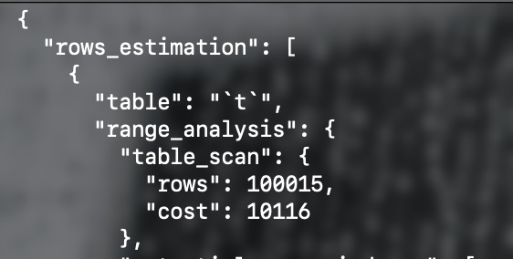

从上图可以看出，table_scan，也就是做全表扫描时，预计的cost为10016，与我们预估的成本相符

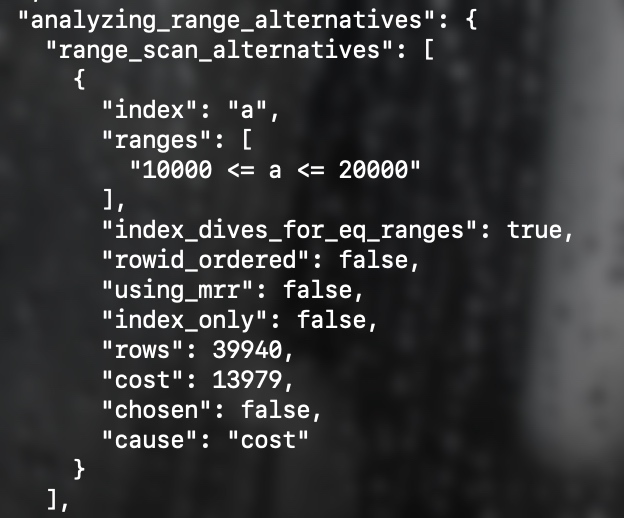

而在接下来的索引a成本预估时，我们可以看到，预计的cost为13979，而rows为39940，比我们预期的10001要多的多，我们再按照回表行数39940进行一次成本预估公式的计算。
```
(1*0.25+39940*0.25) + (39940*0.1+0.01) = 13979.26
```
结果与mysql实际预估的成本完全相符。那么mysql在成本预估时，扫描行数又是怎么判断的呢？
### 扫描行数预估
MySQL 在真正开始执行语句之前，并不能精确地知道满足这个条件的记录有多少条，而只能根据统计信息来估算记录数。

这个统计信息就是索引的“区分度”。显然，一个索引上不同的值越多，这个索引的区分度就越好。而一个索引上不同的值的个数，我们称之为“基数”（cardinality）。也就是说，这个基数越大，索引的区分度越好。

我们可以使用 show index 方法，看到一个索引的基数。如下图所示，就是表 t 的 show index 的结果 。虽然这个表的每一行的三个字段值都是一样的，但是在统计信息中，这三个索引的基数值并不同，而且其实都不准确。（准确的值应该是100000）
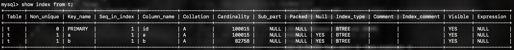

那么，MySQL 是怎样得到索引的基数的呢？这里，我给你简单介绍一下 MySQL 采样统计的方法。

采样统计的时候，InnoDB 默认会选择 N 个数据页，统计这些页面上的**不同值**，得到一个平均值，然后乘以这个索引的页面数，就得到了这个索引的基数。

而数据表是会持续更新的，索引统计信息也不会固定不变。所以，当变更的数据行数超过 1/M 的时候，会自动触发重新做一次索引统计。

在MySQL中，有两种存储索引统计的方式，可以通过设置参数 innodb_stats_persistent 的值来选择：
- 设置为 on 的时候，表示统计信息会持久化存储。这时，默认的 N是20，M是10
- 设置为 off 的时候，表示统计信息只存储在内存中。这时，默认的 N是8，M是16

但从上图中我们也可以看出，索引的基数预估虽然不够准确，但大体上还是差不多的，导致mysql扫描行数预估失败一定还另有原因。

前面我们讲到，mysql通过采样取平均的方式预估二级索引每页存储的基数与行数，在此基础上，mysql又预测了执行计划需要扫描的页数，乘以每页索引存储的记录数，就得到了一次查询计划所需要扫描的行数。

mysql在预估二级索引执行计划成本时，查询一个区间内最左记录所在页与最右记录所在页，并计算两页之间包含了几个数据页，就得到了一个执行计划所需要扫描的页数。

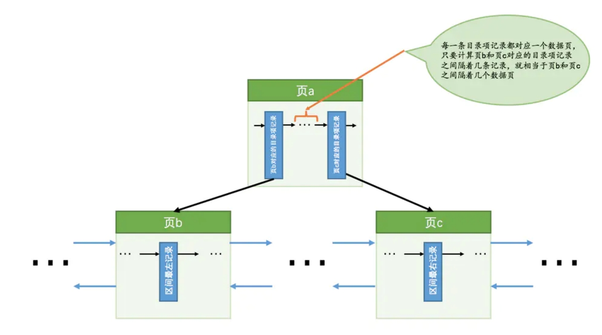

在此基础上，回过来看我们之前提到的两个问题。

1. 为什么mysql在上述case中选择了错误的执行计划？

   在事务提交前，mysql在执行数据删除时，仅会生成一条删除该记录的undo log，不会对数据做真实的删除。所以在新数据写入时，会在原二级索引a上另外插入一份新的数据，且由于新插入数据行a的值没有变化而非增量顺序插入，插入时会产生页分裂。所以mysql在执行页数预测时，查找左值为10000的页与右值为20000的页并计算二者之间页数，其中包含了已逻辑删除的数据页，会导致预测的页数增多。而由于事务还未提交，表还未真实产生变更，此时单页数据的行数预测值还没有刷新，最终导致了预估需要扫描的数据行数大于实际扫描的数据行数。
   
   

2. 为什么将主键索引修改为自增之后才出现这种问题，而按照mysql45讲中给到的case没有复现问题？
   
   当主键为非自增id时，mysql在插入新纪录时会发现，相同索引行下已有相同的主键id，所以会复用之前的空间，并不会产生页分裂。
   
## 课后问题
### Q2 为什么mysql45讲作者给的例子同时开启了一个一致性视图，而我们后续的例子中不需要开启一致性视图就可以复现问题？
### Q3 在上文case中，为什么实际数据行数变为了2倍，而预测扫描的行数变为了4倍左右呢？（**此问题本人暂时也没有找到答案，大家感兴趣可以一起想一下，猜测与页分裂有关，提供答案者奖奶茶一杯**）
#### case1(20w数据，每个二级索引节点对应两个主键id，查询10000条)
```
CREATE TABLE t (
  id int(11) NOT NULL AUTO_INCREMENT,
  a int(11) DEFAULT NULL,
  b int(11) DEFAULT NULL,
  PRIMARY KEY (id),
  KEY a (a),
  KEY b (b)
) ENGINE=InnoDB;

delimiter ;;
create procedure idata()
begin
  declare i int;
  set i=1;
  while(i<=50000)do
    insert into t values(null, i, i);
    set i=i+1;
  end while;
end;;
delimiter ;
call idata();
call idata();

select * from t where a between 10000 and 20000;
select * from information_schema.OPTIMIZER_TRACE\G;
```
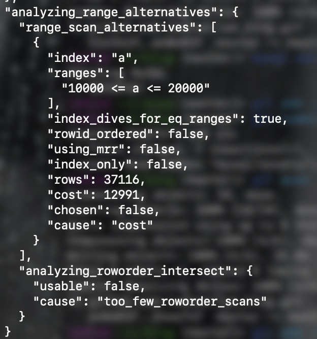
数据集为主键1-100000，a，b也为1-100000，主键100001-200000，a，b为1-100000。实际扫描20002行，mysql预估扫描37116行
#### case2(10w数据，每个二级索引节点对应两个主键id，查询10000条)
```
CREATE TABLE t2 (
  id int(11) NOT NULL AUTO_INCREMENT,
  a int(11) DEFAULT NULL,
  b int(11) DEFAULT NULL,
  PRIMARY KEY (id),
  KEY a (a),
  KEY b (b)
) ENGINE=InnoDB;

delimiter ;;
create procedure idata2()
begin
  declare i int;
  set i=1;
  while(i<=50000)do
    insert into t2 values(null, i, i);
    set i=i+1;
  end while;
end;;
delimiter ;
call idata2();
call idata2();

select * from t2 where a between 10000 and 20000;
select * from information_schema.OPTIMIZER_TRACE\G;
```
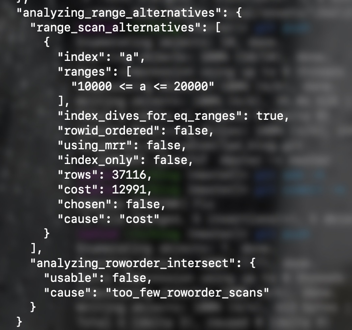
数据集为主键1-50000，a，b也为1-50000，主键50001-100000，a，b为1-50000。实际扫描20002行，mysql预估扫描37116行
#### case3(20w数据，每个二级索引节点对应两个主键id，查询5000条)
```
CREATE TABLE t3 (
  id int(11) NOT NULL AUTO_INCREMENT,
  a int(11) DEFAULT NULL,
  b int(11) DEFAULT NULL,
  PRIMARY KEY (id),
  KEY a (a),
  KEY b (b)
) ENGINE=InnoDB;

delimiter ;;
create procedure idata3()
begin
  declare i int;
  set i=1;
  while(i<=100000)do
    insert into t3 values(null, i, i);
    set i=i+1;
  end while;
end;;
delimiter ;
call idata3();
call idata3();

select * from t3 where a between 5000 and 10000;
select * from information_schema.OPTIMIZER_TRACE\G;
```
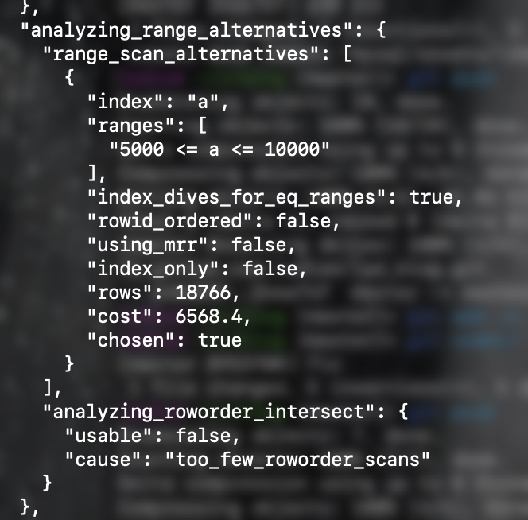

数据集为主键1-100000，a，b也为1-100000，主键100001-200000，a，b为1-100000。实际扫描10002行，mysql预估扫描18766行
#### case4(20w数据，每个二级索引节点对应4个主键id，查询10000条)
```
CREATE TABLE t4 (
  id int(11) NOT NULL AUTO_INCREMENT,
  a int(11) DEFAULT NULL,
  b int(11) DEFAULT NULL,
  PRIMARY KEY (id),
  KEY a (a),
  KEY b (b)
) ENGINE=InnoDB;

delimiter ;;
create procedure idata4()
begin
  declare i int;
  set i=1;
  while(i<=50000)do
    insert into t4 values(null, i, i);
    set i=i+1;
  end while;
end;;
delimiter ;
call idata4();
call idata4();
call idata4();
call idata4();

select * from t4 where a between 10000 and 20000;
select * from information_schema.OPTIMIZER_TRACE\G;
```
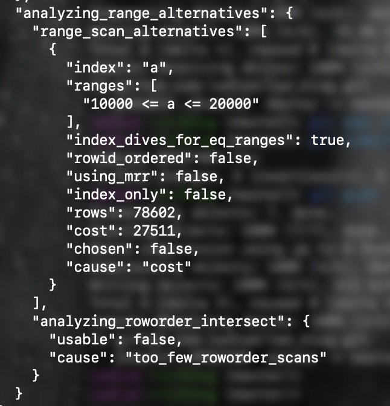

数据集为主键1-50000，a，b也为1-50000，主键50001-100000，a，b为1-500000，主键100001-150000，a，b为1-500000，主键150001-200000，a，b为1-500000，实际扫描20004行，mysql预估扫描78602行

**根据以上4个case看起来，同一二级索引节点对应2个主键时，预估为实际扫描的2倍，同一二级索引节点对应4个主键时，预估为实际扫描的四倍，猜测预估的扫描行数与实际扫描行数之间的倍数关系和二级索引上对应的主键id个数有关系**