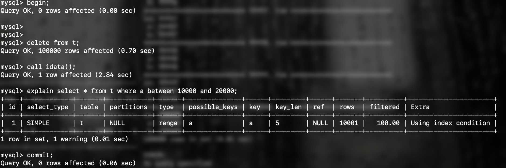

# mysql实战45讲-MySQL为什么有时候会选错索引？
## 课前回顾
### Q1 
## 引言
前面我们介绍过索引，你已经知道了在 MySQL 中一张表其实是可以支持多个索引的。但是，你写 SQL 语句的时候，并没有主动指定使用哪个索引。也就是说，使用哪个索引是由 MySQL 来确定的。那么mysql是怎么选取索引的呢。不知道你有没有碰到过这种情况，一条本来可以执行得很快的语句，却由于 MySQL 选错了索引，而导致执行速度变得很慢？
## 案例case
我们先建一张表，里面除了主键，还有a，b两个字段，分别建上索引
```
CREATE TABLE t (
  id int(11) NOT NULL,
  a int(11) DEFAULT NULL,
  b int(11) DEFAULT NULL,
  PRIMARY KEY (id),
  KEY a (a),
  KEY b (b)
) ENGINE=InnoDB;
```
然后，我们往表 t 中插入 10 万行记录，取值按整数递增，即：(1,1,1)，(2,2,2)，(3,3,3) 直到 (100000,100000,100000)
```
delimiter ;;
create procedure idata()
begin
  declare i int;
  set i=1;
  while(i<=100000)do
    insert into t values(i, i, i);
    set i=i+1;
  end while;
end;;
delimiter ;
call idata();
```
接下来，我们分析一条 SQL 语句：
``` 
select * from t where a between 10000 and 20000;
```
你一定会说，这个语句还用分析吗，很简单呀，a 上有索引，肯定是要使用索引 a 的。
你说得没错，下图显示的就是使用 explain 命令看到的这条语句的执行情况。

看上去，这条查询语句的执行也确实符合预期，key 这个字段值是’a’，表示优化器选择了索引 a。

不过别急，这个案例不会这么简单。在我们已经准备好的包含了 10 万行数据的表上，我们再做如下操作。

大家来猜一下，这时select语句的索引选择情况如何呢？

可以看到，该条select语句依然选择了索引a，但mysql45讲中告诉我们按照这个case执行，这条语句不会选择索引a，这是怎么回事？不要着急，我们修改一下我们的表。
```
alter table t modify column id int(11) not null auto_increment;
```
由于修改了主键为自增主键，所以存储过程我们也需要修改一下
```
drop procedure idata;
delimiter ;;
create procedure idata()
begin
  declare i int;
  set i=1;
  while(i<=100000)do
    insert into t values(null, i, i);
    set i=i+1;
  end while;
end;;
delimiter ;
```

可以发现，在这种情况下查询没有走索引a，这又是为什么呢？
## mysql优化器的成本预估
