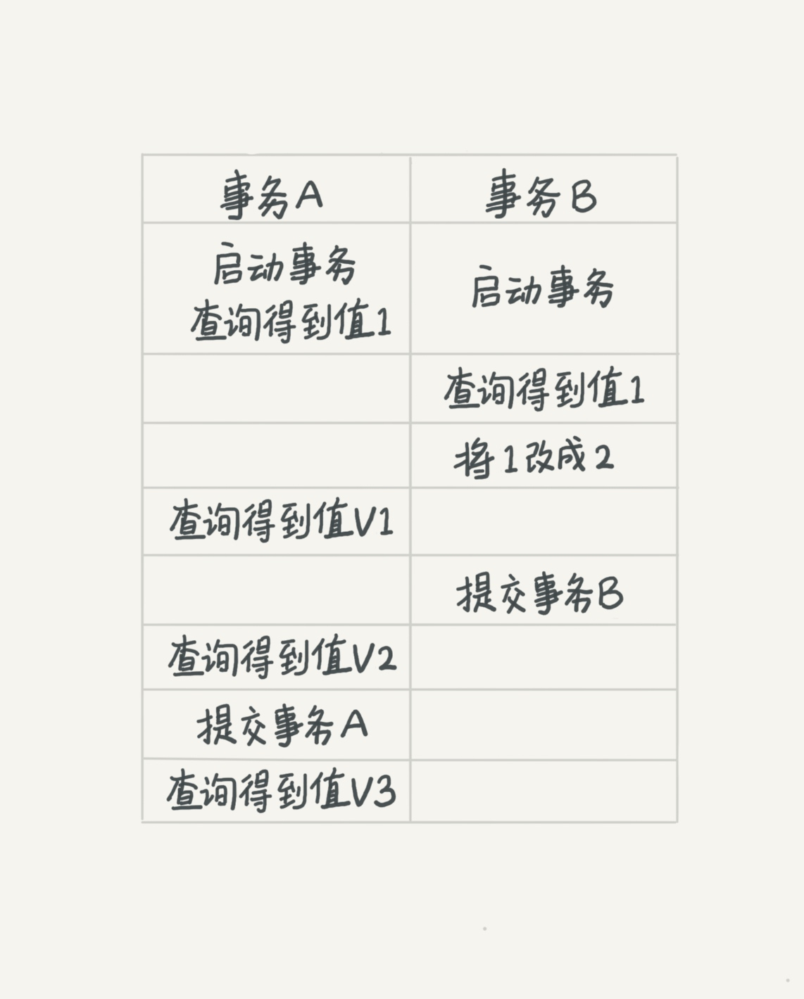

# mysql实战45讲-事务隔离
## 课前回顾
### Q1 innodb为什么需要redo log，使用bin log做容灾可以不？
## 基础概念
> 在今天课程开始之前我们先复习一下一些基础概念
### 什么是事务
**事务**是计算机常用的一种机制，包含了一组计算机操作指令，事务把所有指令作为一个整体一起向系统提交或撤销。即事务中的所有指令，要么都执行，要么都不执行，是一个不可分割的工作逻辑单元。
### 事务的特性
事务具有四个特性，**原子性(Atomicity)**，**一致性(Consistency)**，**隔离性(Isolation)**，**持久性(Durability)**
- **原子性**指事务是一个完整的操作，必须作为一个整体提交或回滚。
- **一致性**指事务执行前后，数据的完整性必须保持一致。
- **隔离性**指所有事务对数据的操作彼此之间是隔离的，事务之间是独立的，不应以任何方式依赖或影响其它事务。
- **持久性**指一个事务一旦被提交，它对数据的改变就是永久性的。
### 隔离性与隔离级别
当有多个事务并发操作同一数据时，如果隔离性没有保障，就可能出现**脏读(dirty read)**，**不可重复读(non-repeatable read)**，**幻读(phantom read)** 的问题。为了解决上述问题，就有了隔离级别的概念。

在谈隔离级别之前，我们应该可以想到，隔离的越严，效率就会越低，因此我们需要在二者之间找到一个平衡点。mysql将事务的隔离划分为四个级别，**读未提交(read uncommitted)**，**读提交(read committed)**，**可重复读(repeatable read)**，**串行化(serializable)**。

#### 读未提交(read uncommitted)
不做任何隔离，一个事务还没commit时，它做的变更就可以被其它事务看到；在**读未提交**的隔离级别下，假设事务A修改某一数据后回滚，事务B查询事务A修改的值时，可能出现读到未提交的脏数据的情况，即**脏读**。
#### 读提交(read committed)
仅当一个事务commit之后，它做的变更才可以被其它事务看到；在**读提交**的隔离级别下，假设事务A修改某一数据，事务B在执行过程中两次查询了事务A修改的值时，可能出现两次查询结果不一致的情况，即**不可重复读**。
#### 可重复读(repeatable read)
一个事物执行过程中，总是和事务启动时看到的数据是一致的；在**可重复读**隔离级别下，假设事务A插入一条数据，事务B在执行过程中两次进行范围查询，可能出现两次查询结果不一致的情况，即**幻读**。
#### 串行化(serializable)
所有事务严格按照串行执行。

#### Q2 在不同的隔离级别下，事务 A 会有哪些不同的返回结果，也就是图里面 V1、V2、V3 的返回值分别是什么。
## InnoDB事务隔离的实现
接下来正式开始我们今天的学习。

在**串行化**的隔离级别下，所有事务都是串行的，我们可以自然地想到对所有事务加表级的互斥锁即可实现。

那**读提交**和**可重复读**是怎么实现的呢？首先提出一个快照的概念，mysql在事务的执行过程中，可以在任意节点对数据的当前状态做一个快照记录，后续的所有访问以快照的访问结果为准。但如果我们的表有100G，那岂不是每次事务处理过程都要拷贝100G的数据？实际上，mysql的事务实现并不需要拷贝整表的数据。

在 MySQL 中，实际上每条记录在更新的时候都会同时记录一条回滚操作。记录上的最新值，通过回滚操作，都可以得到前一个状态的值。因此，在不同时刻开启的事务都可以根据回滚记录获取到当前的读视图(read-view)。这种视图读的方式，即我们常说的**多版本并发控制(Multi-Version Concurrency Control)**
### innodb的mvcc是怎么实现的？
#### 事务版本号
事务每次开启时，都会从数据库获得一个自增长的事务ID，可以从事务ID判断事务的执行先后顺序。这就是事务版本号。
#### 隐藏字段
在innodb中，每一行记录都有2个隐藏字段，trix_id和roll_pointer，如果数据表中存在主键或非null的unique索引则不会创建row_id，否则还会自动生成第3个隐藏字段，自增的隐藏主键row_id。
- trx_id:记录生成该行数据的事务id
- roll_pointer:回滚指针，指向该行记录的undo log
- row_id:自增的隐藏主键id
#### undolog
undo log可以理解成回滚日志,它存储的是老版本数据。在表记录修改之前，会先把原始数据拷贝到undo log里，如果事务回滚，即可以通过undo log来还原数据。或者如果当前记录行不可见，可以顺着undo log链找到满足其可见性条件的记录行版本。

在innodb中，undolog分为两类
- insert undolog：事务对insert新记录时产生的undo log, 只在事务回滚时需要, 并且在事务提交后就可以立即丢弃。
- update undolog：事务对记录进行delete和update操作时产生的undo log，不仅在事务回滚时需要，快照读也需要，只有当数据库所使用的快照中不涉及该日志记录，对应的回滚日志才会被删除。
#### read view
read view是事务在进行**快照读**的时候生成的记录快照, 可以帮助我们解决可见性问题。read view记录了快照生成时**当前事务开启时所有活跃的事务列表**。read view中包含一下几个关键属性
- trx_ids：生成该read view时所有活跃的事务id list，不包含生成自己的事务id
- low_limit_id：目前出现过的最大事务id+1，即下一个将被分配的事务id
- up_limit_id：活跃事务列表中的最小事务id，若trx_ids为空，则为low_limit_id
- creator_trx_id：生成该read view的事务id
#### 实现原理

innodb在事务启动时，会为该事务创建一个read view，记录下当前的活跃事务信息。在读取数据时，会判断该行数据是否可见，若该版本数据不可见，则会遍历历史版本，知道找到可见版本。

判断数据行是否可见的条件如下：
1. 该行数据的trix_id等于read view的creator_trx_id，那么该行数据是由自身事务生成的，可见。
2. 该行数据的trx_id小于read view的up_limit_id，那么该数据是在read view生成之前提交的，可见。
3. 该行数据的trx_id大于等于read view的low_limit_id，那么该数据是在read view生成之后提交的，不可见。
4. 该行数据的trx_id在read view的up_limit_id和low_limit_id之间，说明read view生成时，该事务可能处在活跃状态，则判断trx_id是否在read view的trx_ids中，若在，则不可见，反之则可见。
### read committed和repeatable read是怎么实现的？
innodb通过控制不同的视图创建时机，实现不同的隔离级别。在rc级别下，每次select语句执行时生成read-view，在rr级别下，事务的第一个select语句执行时生成read-view。
### mvcc关键代码
#### read view(/storage/innobase/include/read0types.h)
```
class ReadView {
  private:
  /** The read should not see any transaction with trx id >= this
  value. In other words, this is the "high water mark". */
  trx_id_t m_low_limit_id;

  /** The read should see all trx ids which are strictly
  smaller (<) than this value.  In other words, this is the
  low water mark". */
  trx_id_t m_up_limit_id;

  /** trx id of creating transaction, set to TRX_ID_MAX for free
  views. */
  trx_id_t m_creator_trx_id;

  /** Set of RW transactions that was active when this snapshot
  was taken */
  ids_t m_ids;

  /** The view does not need to see the undo logs for transactions
  whose transaction number is strictly smaller (<) than this value:
  they can be removed in purge if not needed by other views */
  trx_id_t m_low_limit_no;
  
  /** Check whether the changes by id are visible.
  @param[in]    id      transaction id to check against the view
  @param[in]    name    table name
  @return whether the view sees the modifications of id. */
  [[nodiscard]] bool changes_visible(trx_id_t id,
                                     const table_name_t &name) const {
    ut_ad(id > 0); // 参数合法性校验

    if (id < m_up_limit_id || id == m_creator_trx_id) {
      return (true);
    }

    check_trx_id_sanity(id, name); // 判断trx_id合法性（是否超过当前系统已生成的最大事务id）

    if (id >= m_low_limit_id) {
      return (false);

    } else if (m_ids.empty()) { // 不存在活跃中的事务
      return (true);
    }

    const ids_t::value_type *p = m_ids.data();

    return (!std::binary_search(p, p + m_ids.size(), id));
  }
}
```
### mvcc是否可以彻底解决重复读和幻读的问题？如果解决了，那事务是不是就完全与世隔绝了？
在前面我们了解到，mvcc使得我们的读操作最终执行为读取read-view，在rr隔离级别下，其它事务无法修改当前事务使用的read-view，所以对**快照读**这一类行为，mvcc可以解决幻读问题。那么是否有查询行为不读取read-view，而是执行**当前读**呢？实际上，在rr隔离级别下，除了普通的select操作，其余操作都是**当前读**。如

``` select ... lock in share mode ```

``` select ... for update ```

``` update ..., delete ..., insert ... ```

我们使用一个case来具体看下，同时开启两个事务，在**快照读**时，事务1在事务2更新前后读取到的数据一致。而如果我们使用**当前读**，可以看到事务1在事务2更新后读取到的数据为最新数据。

从上述结论可以看出，mvcc也并不能完全解决**重复读**和**幻读**的问题，那么innodb又是怎么解决这两个问题的呢？解决**重复读**并不难，在select语句中如果执行的是当前读，会对当前行上一个S锁，防止有另一个事务并发更新该行数据。但**幻读**是怎么解决的呢？
### 幻读会造成什么影响？
前面我们说到幻读会造成一个事务中前后两次范围查询的结果不同，但这到底会给我们的业务造成什么问题？话不多说直接上例子，还是刚刚的那张表```(a int, b int)```里面有两行数据```(1, 2), (2, 4)```
|time |session1 |session2 |session3|
|-|-|-|-|
|t1 |```select * from t where a = 1 for update```|-|-|
|t2 |-|```update t set a = 1 where b = 4```|-|
|t3 |-|```commit```|-|
|t4 |```select * from t where a = 1 for update```|-|-|
|t5 |-|-|```insert into t values(1, 8)```|
|t6 |-|-|```commit```|
|t7 |```select * from t where a = 1 for update```|-|-|
|t8 |```commit```|-|-|

在t1时刻，我们读到的结果为(1,2)这一行数据；在t4时刻，我们读到的结果为(1,2), (1,4)这两行数据；在t7时刻，我们读到的结果为(1,2), (1,4), (1,8)这三行数据。

> Attention：此处提到的session1看到session2的修改结果并非幻读，幻读仅指插入语句带来的问题

由于我们的select语句都加了for update，按照**当前读**的逻辑，以上的三个结果看起来是符合预期的，并且也是合乎逻辑的，那么幻读到底有啥问题呢？

**我们最终要保障的是数据一致性问题**，我们在上述流程中加上一条sql语句
|time |session1 |session2 |session3|
|-|-|-|-|
|t1 |```select * from t where a = 1 for update```|-|-|
|t2 |```update t set b = 0 where a = 1```|-|-|
|t3 |-|```update t set a = 1 where b = 2```|-|
|t4 |-|```commit```|-|
|t5 |```select * from t where a = 1 for update```|-|-|
|t6 |-|-|```insert into t values(1, 8)```|
|t7 |-|-|```commit```|
|t8 |```select * from t where a = 1 for update```|-|-|
|t9 |```commit```|-|-|

在t2时刻，数据库中的数据情况为(1,0),(2,4)；在t4时刻，数据库中的情况变为(1,0),(1,2)；在t7时刻，数据库中的情况变为(1,0),(1,2),(1,8)。

而与此同时，binlog中写入的内容为
```
T4时刻session2提交：update t set a = 1 where b = 2
T7时刻session3提交：insert into t values(1, 8)
T9时刻session1提交：update t set b = 0 where a = 1
```
如果此时我们的数据库按照binlog进行了主从同步，那么从库中的数据将会变为(1,0),(1,0),(1,0)，很显然，这就是幻读造成的问题。
### innodb怎么解决幻读？
产生幻读的主要原因是，在我们进行**当前读**的时候，行锁只能锁住当前行，但插入记录这个动作无法上锁。因此，为了解决这个问题，innodb引入了间隙锁（Gap Lock），在执行**当前读**时，不只会给当前行上锁，还会给可能受到影响的行间隙上锁，这样也就确保了无法插入新的可能产生幻读的记录。mysql锁的种类及实现这里不做展开，后续有专题讲解。
## 事务的启动方式
如前面所述，长事务有很多潜在风险，我们在业务开发中应该尽量避免。其实很多时候业务开发同学并不是有意使用长事务，通常是由于误用所致。mysql中事务的启动方式有以下几种：
1. 显示启动事务语句， begin 或 start transaction。配套的提交语句是 commit，回滚语句是 rollback。
2. set autocommit=0，这个命令会将这个线程的自动提交关掉。意味着如果你只执行一个 select 语句，这个事务就启动了，而且并不会自动提交。这个事务持续存在直到你主动执行 commit 或 rollback 语句，或者断开连接。

有些客户端连接框架会默认连接成功后先执行一个 set autocommit=0 的命令。这就导致接下来的查询都在事务中，如果是长连接，就导致了意外的长事务。mysql45讲作者建议我们选择set autocommit=1，通过显式的语句来启动事务。
## 小结&&问题
本章中我们介绍了mysql的事务隔离，并简单介绍了innodb的mvcc实现原理，根据实现原理分析了长事务存在的风险以及如何用正确的方式避免出现长事务。在这里我们根据上述所讲抛出几个问题，并将在第八讲**事务到底是隔离的还是不隔离的**中更加深入地研究mysql的事务与隔离问题。
### Q3 你现在知道了系统里面应该避免长事务，如果你是业务开发负责人同时也是数据库负责人，你会有什么方案来避免出现或者处理这种情况呢？
### Q4 若在mysql中，我们只用using index语句查询索引数据，是否还需要回表查询？
### Q5 undolog是否有持久化？不持久化的话什么时候清理？在这种机制下，慢查询会带来什么问题？
### Q6 在**幻读会造成什么影响**这一问题的解答中，我们提到了session2的更新语句也会带来类似幻读的问题，这种问题在mysql中被称为什么？innodb又是怎么解决这种问题的呢？